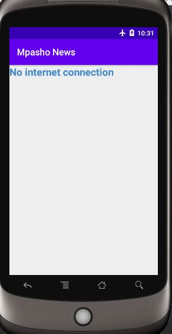

# Mpasho-News-App
This is a news app to help me learn adanced netwoking in android
- Connecting to an API(https://content.guardianapis.com/search?q=debates&api-key=test)
- Parsing the JSON response
- Handling error cases gracefully, like logs/printstacks
- Updating news information regularly on listview 
- Using  Loaders, LoaderManager.LoaderCallbacks
- Doing network operations independent of the Activity lifecycle using background threads
- Use Uri.Builder class to add query parameters to the URL

## Display news queried

  

## on clicking opens the news URL link

## Display no iternet connection incase no internet available. Also show no news articles found in case of a broken link or faults with links.

